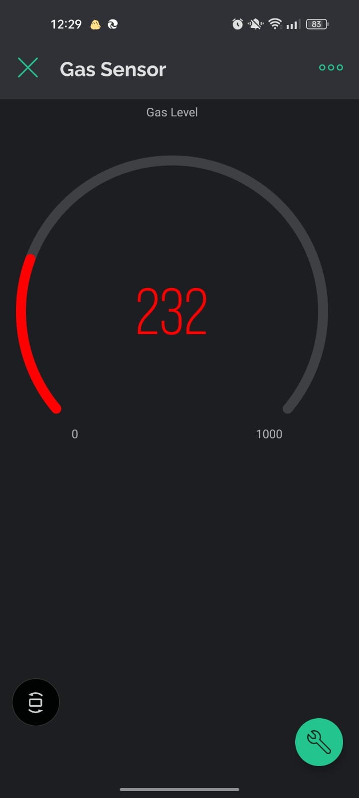
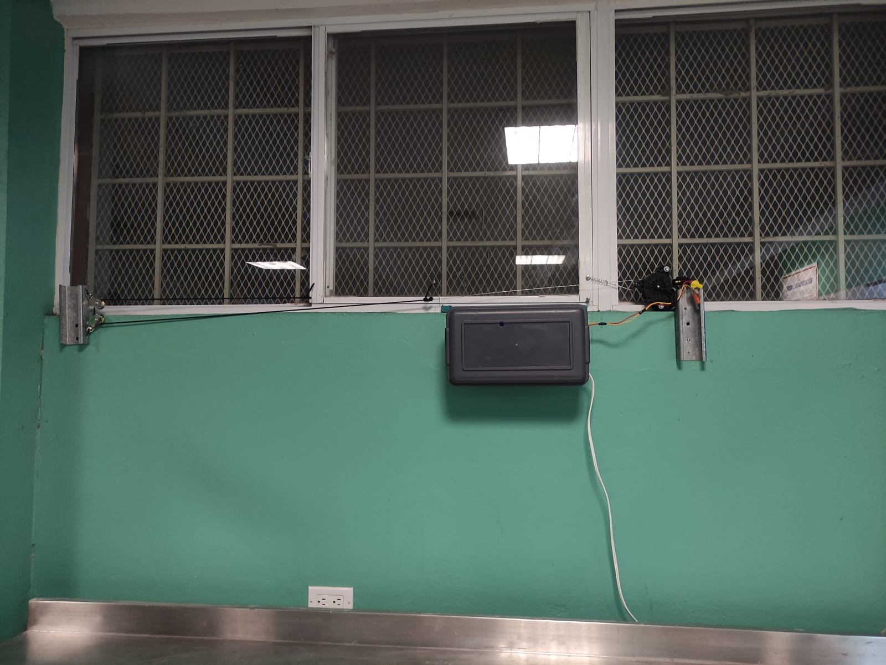

# Sensor-Monoxido-Carbono-Esp8266

Implementación de basada en Blynk sobre un sensor de monóxido de carbono.

## Description

Implementación de un sistema de detección de fugas de monóxido de carbono, se conecta a la red para transmitir los niveles de monóxido de carbono sensados (ppm), enviados a una aplicación en Blynk.

Creditos a su autor original: Ingeniero Ángel Javier Delgado Ibarra.
Y a contribuyentes:
Ingeniero Christian Axel Rodriguez Medrano.
Ingeniero Giovanni Gómez.

## Screenshots

